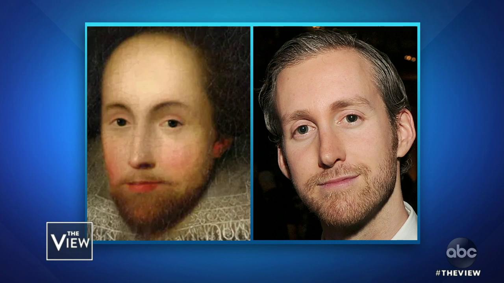
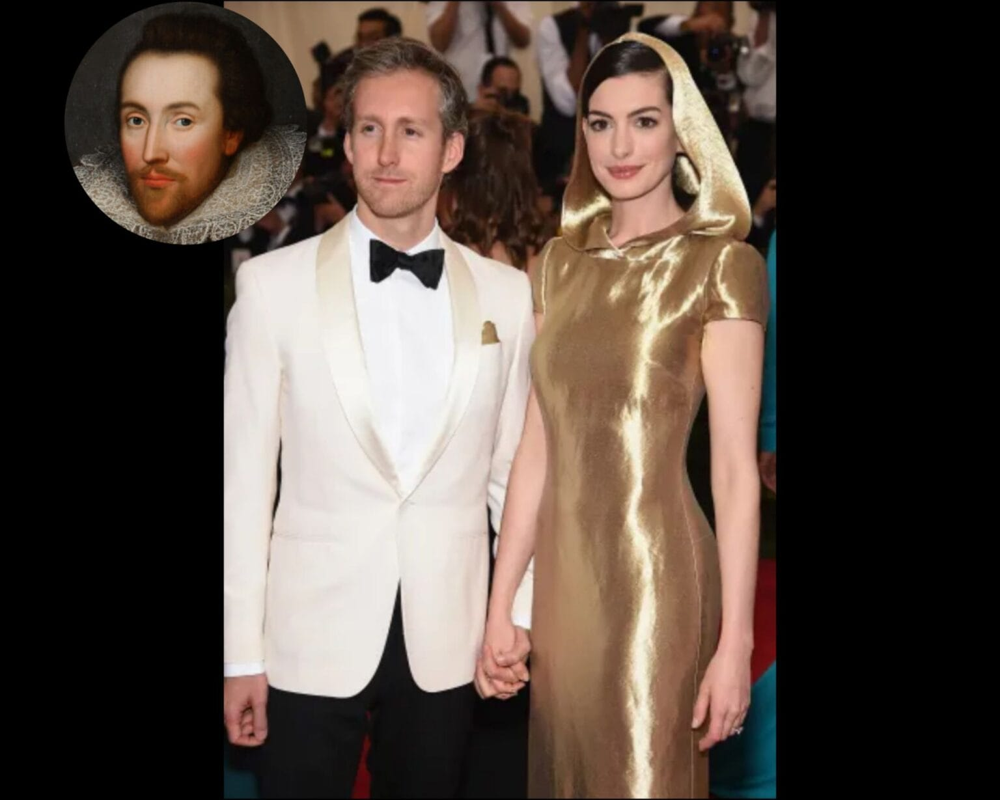
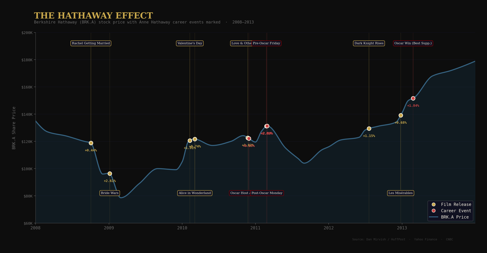

<!-- _class: lead title-slide -->
<!-- _header: "" -->

# The Hathaway Dossier
## A sober, evidence-based inquiry into the reincarnation of Shakespeare's wife

**Classification**: Eyes only
**Threat level**: Deeply unsettling
**Date**: March 2026

---

<!-- _header: "" -->
<!-- _class: lead title-slide -->

# Before We Begin

### The questions this presentation will answer

1. **Is the name a coincidence?** (it is not)
2. **Is her husband who we think he is?** (he is not)
3. **Did Shakespeare make a promise?** (he did)
4. **Is she aging normally?** (she is not)
5. **Is she moving financial markets?** (she is)

> *"I will not be taking questions at this time."*

---

<!-- _header: "" -->
<!-- _class: lead part-identity -->

# Part I: The Identity

**She has this name for a reason**

---

<!-- header: "**The Identity** > The Husband > The Evidence" -->

# Exhibit A: The Name

In **November 1582**, a marriage bond was issued in Worcester, England, for one William Shakespeare and one **Anne Hathaway**.

On **November 12, 1982** — exactly **400 years later, to the month** — a girl was born in Brooklyn, New York. Her parents named her **Anne Hathaway**.

They have confirmed publicly that they named her after Shakespeare's wife.

> A reasonable person might call this charming.
> A reasonable person would be wrong to stop here.

---

<!-- _header: "" -->
<!-- _class: lead part-husband -->

# Part II: The Husband

**He has been here before**

---

<!-- header: "The Identity > **The Husband** > The Evidence" -->

# Exhibit B: The Face

This image aired on **The View** in 2019.

**Left:** The Chandos portrait of William Shakespeare, c. 1600–1610. The only portrait with a credible claim to have been painted from life.

**Right:** **Adam Shulman.** Husband of Anne Hathaway.

Same forehead. Same brow ridge. Same nose. Same beard. Same deep-set eyes.

If you showed this image to a stranger, they would ask why one photo is in color and the other is in oil paint.

This is not pareidolia. This is a match.

---

<!-- header: "The Identity > **The Husband** > The Evidence" -->

# Exhibit C: The Promise

Shakespeare reportedly wrote to his wife:

> *"Life is too short to love you in one. I promise to look for you in the next."*

**The original arrangement:** Shakespeare left Stratford in 1585. Anne raised their three children alone for decades. He became the most famous writer in the English language. She was erased from history.

**The corrected arrangement:**

- **Anne Hathaway** — Academy Award winner. $6.8 billion worldwide box office. Global household name. UN Women goodwill ambassador
- **Adam Shulman** — quiet jewelry designer. Avoids cameras. Devoted husband and father. Produced one indie film. Designed her engagement ring himself

Shakespeare left. Shulman stayed. **The promise was kept.**

---

<!-- _header: "" -->
<!-- _class: lead part-evidence -->

# Part III: The Evidence

**The universe left receipts**

---

<!-- header: "The Identity > The Husband > **The Evidence**" -->

# Exhibit D: She Is Not Aging

Anne Hathaway has been in public life since 2001. She is **43 years old**.

She appears to have aged approximately four years. Perhaps five, if one is being generous.

In **March 2026 — this month** — she posted a makeup-free video on social media. She then cut to images of William Shakespeare and his wife, looked directly into the camera, and said:

**"It was intense."** — [watch the video](https://www.instagram.com/reel/DWJyHaSDoie/?igsh=NTc4MTIwNjQ2YQ==)

She is no longer denying it.

The question is whether she is playing.

---

<!-- header: "The Identity > The Husband > **The Evidence**" -->

# Exhibit E: The Hathaway Effect

When Anne Hathaway makes headlines, **Berkshire Hathaway (BRK.A) stock goes up.**

**The mechanism:** trading algorithms scan for sentiment data and cannot tell "Anne Hathaway the actress" from "Hathaway the company." Positive headlines → buy signal → stock rises.

A University of Kansas study confirmed **higher trading volume** on Anne Hathaway news days.

**The Bard's wife is moving markets.**

---

<!-- header: "The Identity > The Husband > **The Evidence**" -->

# The Verdict

Each fact, taken individually, is a coincidence.

| Exhibit | The fact |
|---|---|
| A - The name | Born exactly 400 years after Shakespeare married his Anne Hathaway |
| B - The face | Husband physically near-identical to the only portrait of Shakespeare painted from life |
| C - The promise | Shakespeare abandoned his wife for fame; Shulman is content to stand behind her |
| D - The agelessness | 25 years in public life; not aging; not denying it |
| E - The market | Her name moves financial markets through forces she does not control |

Taken together, they are a pattern.

---

<!-- _header: "" -->
<!-- _class: lead title-slide -->

# Case Closed

### (Except it isn't.)

> *"The course of true love never did run smooth."*
> Perhaps because sometimes it takes more than one lifetime to get it right.

*This presentation is intended for entertainment purposes. The author maintains a studied neutrality on the question of interdimensional matrimony.*
