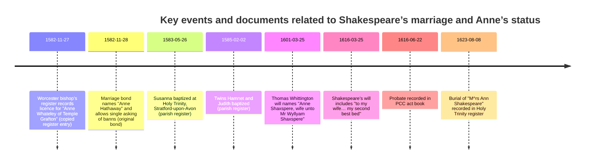

# Anne Hathaway as Shakespeare’s Wife: Primary Evidence, Scholarly Consensus, and the “Secret/Non‑Traditional Marriage” Narrative

## Executive summary

The claim that Anne Hathaway was the wife of William Shakespeare is not a fringe proposition in scholarship; it is the mainstream conclusion supported by multiple independent records made during (or very close to) Shakespeare’s lifetime. citeturn3view0turn35view0turn6view0turn8view0

What *does* invite conspiratorial elaboration is the unusual *shape* of the surviving marriage evidence. Only two ecclesiastical instruments survive for the late‑November 1582 marriage process: (1) a register entry (a retrospective copy) noting a marriage licence for “Anne Whateley of Temple Grafton,” and (2) an original marriage bond (dated the next day) naming “Anne Hathaway,” posted “under the special condition of a single asking of the banns.” citeturn7view0turn7view3turn6view0turn25view0

Two high‑value corroborators sharply constrain what “conspiracy” can plausibly mean here. A 1601 will by Thomas Whittington—made while Shakespeare was alive—explicitly calls the relevant woman “Anne Shaxspere, wyf unto Mr Wyllyam Shaxspere,” linking her to the Hathaway family network in Shottery. citeturn3view0 Shakespeare’s own 1616 will includes the bequest “to my wife … my second best bed with the furniture,” confirming that he recognized a lawful spouse at death (even if his sparse mention of her invites later misreadings). citeturn35view0

Scholarly consensus treats the “Whateley” anomaly as most likely a clerical or copying error (or at minimum an uncorroborated record‑keeping discrepancy), because the register entry is a later copy and because no independent evidence for an “Anne Whateley of Temple Grafton” has been found in the relevant local record ecology, while the bond is an original instrument naming Hathaway. citeturn6view0turn7view3turn30view0 The *location* of the ceremony remains unknown because the licence itself is lost and no surviving parish register records the wedding; this gap is real and is the main “oxygen supply” for claims of a secret, irregular, or strategically concealed marriage. citeturn7view3turn6view0turn19view0

The most common “non‑traditional/secretive” marriage narratives—(a) a lovers’ triangle with two Annes; (b) a clandestine or “handfast” pre‑contract prior to a hurried church marriage; (c) deliberate suppression/removal of the marriage record—depend heavily on inference and selective emphasis rather than on new primary evidence. They persist because the archive is incomplete, because the name discrepancy is intrinsically dramatic, and because later cultural tropes (especially around the “second‑best bed”) invite moralized storytelling. citeturn30view1turn20view0turn35view0turn36view0

## Research approach and evaluative criteria

This report prioritizes primary/official records surfaced and contextualized by entity["organization","Folger Shakespeare Library","washington, dc, us"]’s “entity["organization","Shakespeare Documented","folger online documentary archive"]” project and partner repositories, then situates them against (a) archival best practice for interpreting licence/bond systems and (b) peer‑reviewed or academically curated syntheses—especially those hosted by universities or major heritage institutions. citeturn6view0turn7view0turn31view0turn25view0

Each item is assessed on four dimensions:

Provenance and custody: Is it an original instrument, a later copy, a transcript, or modern retelling? Is the repository a public archive or an informal website? citeturn6view0turn7view0turn3view0turn19view0

Dating and proximity: How close is the record to the 1582 marriage event and to Shakespeare’s lifetime? citeturn6view0turn7view3turn3view0turn35view0

Corroboration: Does the record align with independent documents (children’s baptisms, wills, burial entries), or does it stand alone? citeturn8view0turn33view0turn3view0turn2view2

Scholarly consensus and dispute: Do academic editors treat the record as stable evidence, a known crux, or a speculative springboard? citeturn7view3turn35view0turn30view1turn13search17

Reliability rating used in the table below (5 = highest):

5 — Primary, contemporaneous, original; strong custody; low interpretive risk.  
4 — Primary, contemporaneous, but derivative (copy/register entry) or legally indirect; moderate interpretive risk.  
3 — Primary but only circumstantial/indirect for the marriage claim; or later near‑contemporary memorial text; higher interpretive risk.  
2 — Scholarly secondary synthesis (credible, but not primary evidence).  
1 — Popular media, advocacy, or conspiracy‑leaning interpretations (useful for reception history, not for factual reconstruction).

## Primary and official record base

### What the “marriage bond / licence” system can and cannot prove

Understanding what survives is essential, because many “secret marriage” arguments start by treating a bond as if it were a modern marriage certificate. General archival guidance is consistent across jurisdictions: couples marrying “by licence” typically produced an allegation (asserting no impediment) and, until the nineteenth century, a bond imposing a financial penalty if the allegation proved false; the actual licence was commonly retained by the couple or officiant and often does not survive in diocesan files. citeturn19view0turn27view0

Two constraints matter here. First, the existence of a bond shows that a licence was sought; it does *not*, by itself, prove the marriage occurred (a point stressed in archival guidance). citeturn27view0turn19view0 Second, the Worcester diocesan process is known to be partially lost: the “allegations” that would normally supply personal detail do not survive for Worcester before 1661, making the 1582 evidentiary set unusually dependent on a formulaic bond and a copied register entry. citeturn6view0turn25view0

### The two 1582 Worcester records and why they generate “mystery” narratives

The bishop’s register entry (27 November 1582). A register entry in the entity["organization","Diocese of Worcester","worcester, england, uk"]’s records notes that a marriage licence was issued for Shakespeare to marry “Anne Whateley of Temple Grafton.” It is preserved as part of a license list that appears to have been written up retrospectively rather than day‑by‑day, increasing the plausibility of copying or transcription error. citeturn7view3turn7view0 The entry’s surviving form is therefore best described as a “record of a licence grant,” not the licence instrument itself, which is not extant. citeturn7view3turn25view0

The marriage bond (28 November 1582). The next day’s marriage bond is an original instrument naming “Anne Hathaway of Stratford‑upon‑Avon” and explaining that the bishop would be safeguarded from later objections. It also reflects expedited procedure—documented in the UNESCO nomination as a “special condition of a single asking of the banns”—a legal‑administrative fact that conspiracy sources often reframe as “secret marriage.” citeturn6view0turn25view0turn30view0 Because the bond is original and the register entry is a later copy, documentary editors generally treat the bond’s naming as more reliable on the bride’s identity. citeturn6view0turn7view3turn13search17

The unresolved element is the wedding’s location. Editors emphasize that no surviving parish register records the wedding, and the licence itself is missing, so the ceremony could have occurred at any local church whose register is lost or defective. citeturn7view3turn6view0 This is a genuine archival gap; it is also exactly the kind of gap that enables claims of concealment without requiring new proof. citeturn20view0turn30view1

image_group{"layout":"carousel","aspect_ratio":"16:9","query":["Shakespeare marriage bond 1582 x 797 BA 2783 facsimile","Bishop of Worcester register 1582 Anne Whateley Temple Grafton facsimile","Will of William Shakespeare second best bed PROB 1/4 image","Holy Trinity Stratford parish register Susanna Shakespeare baptism 1583 image"],"num_per_query":1}

### Corroborating family records that anchor “Anne Shakespeare” as wife

Parish registers for the couple’s children do not resolve the Whateley/Hathaway discrepancy directly, but they corroborate a stable household narrative after late 1582: Susanna’s baptism appears in the parish register on 26 May 1583, and the twins Hamnet and Judith are baptized on 2 February 1585. Both entries are treated by documentary editors as part of the core “Shakespeare family” record set preserved by entity["organization","Shakespeare Birthplace Trust","stratford-upon-avon, england, uk"] from the parish register of entity["point_of_interest","Holy Trinity Church","stratford-upon-avon, england, uk"] in entity["city","Stratford-upon-Avon","warwickshire, england, uk"]. citeturn8view0turn33view0turn25view0

The most direct lifetime corroboration is not a parish register entry but a probate document: in 1601, Thomas Whittington’s will references a 40‑shilling sum “in the hand of Anne Shaxspere wyf unto Mr Wyllyam Shaxspere,” requesting that it be distributed to Stratford’s poor. This is unusually valuable because it: (a) is during Shakespeare’s lifetime; (b) uses explicit wife‑language; and (c) situates Anne within a Shottery/Hathaway debt and social network, consistent with Hathaway family ties. citeturn3view0turn21view0turn30view1

Finally, the burial record for “M^rs Ann Shakespeare” (8 August 1623) supplies a stable married surname in an official parish context, with editors noting that diocesan transcripts also recorded her burial as “M^rs Ann Shakespeare.” While this is post‑mortem and therefore less probative about the 1582 ceremony than the Whittington will, it is another formal “Anne = Shakespeare’s wife” anchor that makes a “not really his wife” theory highly implausible. citeturn2view2turn21view0

## Scholarly biographies and academic analyses

### Scholarly consensus on the “two Annes” discrepancy

Documentary editors generally treat the Whateley/Hathaway mismatch as a record‑keeping problem, not evidence of two simultaneous intended brides. The key reasons are methodological: the bond is original; the register entry is a later copy; and the copying process is known to generate discrepancies when compared with surviving bonds. citeturn6view0turn7view3 Academically curated summaries reach the same conclusion: the entity["organization","Internet Shakespeare Editions","uvic peer-reviewed shakespeare site"] (hosted by entity["organization","University of Victoria","victoria, bc, canada"]) explicitly frames “Whateley” as possibly a clerical error and points to Whittington’s will as clearing up the confusion by naming Anne Hathaway as Shakespeare’s wife. citeturn31view0turn30view1

A critical nuance: “clerical error” is not the only logical possibility (in principle, two women could share a forename and be involved), but the archive does not supply the additional independent evidence needed to elevate such a scenario above speculation. In modern documentary practice, the correct posture is therefore: treat the mismatch as a documented crux; privilege the original bond for the bride’s surname; and avoid narrative inflation beyond what corroboration allows. citeturn6view0turn7view3turn3view0

### The “second‑best bed” and how scholarship revises a popular insinuation

A common move in both popular media and conspiratorial writing is to treat Shakespeare’s “second best bed” bequest as proof of a loveless or sham marriage—then use that insinuation to justify claims of separation, secrecy, or “non‑traditional” arrangements. The primary document does not warrant that inference on its own: documentary editors emphasize that “best/second‑best/worst” descriptors were used in wills as identifiers rather than as emotional rankings, and that the bequest is better read as selecting a particular bed and furnishings, not announcing contempt. citeturn35view0turn9search7turn1search26

At the same time, scholarship does not overcorrect into romance‑narrative certainty. Editors explicitly note the oddity that Anne is mentioned nowhere else in the will except via this interlineation—an archival fact that can legitimately be described as a “gap” in what the document reveals about their relationship, even if it does not prove estrangement. citeturn35view0

A useful illustration of contemporary‑to‑modern interpretive drift is visible in major public‑facing history outlets: a 2025 entity["organization","History.com","history media site"] piece (structured around an interview with historian entity["people","Lena Cowen Orlin","shakespeare scholar"]) directly addresses the Whateley/Hathaway mismatch and explicitly prefers “Hathaway” on the ground that the bond is original and witnessed, whereas the register entry is a copy. citeturn13search17turn6view0turn7view3 This aligns with the methodological hierarchy used by documentary editors. citeturn6view0turn7view3

### Biographical synthesis and the limits of what can be responsibly claimed

Modern biographical work increasingly treats Anne not as an empty negative stereotype but as someone whose life can be partially reconstructed via analogous records and local networks—while still acknowledging that the surviving archive is thin compared to modern expectations (no diary; no letter collection). citeturn35view0turn25view0

Institutional scholarship also shows a trend toward giving Anne independent treatment rather than subsuming her under Shakespeare’s biography. A 2021 entity["book_series","Oxford Dictionary of National Biography","oxford biographical reference"] update (discussed publicly by Shakespeare Birthplace Trust scholars) notes new ODNB entries for Anne and her daughters and stresses a “factually accurate” approach that steps back from partisan biographical storytelling. citeturn32view0 This matters for conspiracy evaluation: when a field becomes more explicit about evidentiary limits, it often becomes easier to see where “secret marriage” stories are filling absence with narrative desire rather than discovery. citeturn32view0turn30view1turn25view0

## Conspiracy and popular-media claims that frame the marriage as secret or non-traditional

This section catalogs prominent *types* of claims and representative sources, not to validate them, but to show precisely how they use (and frequently distort) the documentary base.

### The “two Annes” triangle and the idea of a forced or switched marriage

Claim pattern: Shakespeare sought a licence to marry Anne Whateley, but was compelled to marry the (pregnant) Anne Hathaway instead—implying either a lovers’ triangle, coercion, or even legal irregularity that had to be “managed” quietly. citeturn30view1turn13search8turn13search20

Evidence typically cited: the 27 Nov 1582 register entry and 28 Nov 1582 bond; the lack of a parish register marriage entry; the proximity of Susanna’s baptism (May 1583) to the marriage process. citeturn7view3turn6view0turn8view0

Credibility evaluation: the underlying documents are real, but the triangle narrative is not evidenced by any independent corroborator (no “Anne Whateley” life trace; no litigation about a broken precontract; no baptismal anomaly requiring concealment). Documentary editors’ explanation—that the register is a later copy and the bond is original—accounts for the mismatch more parsimoniously, and Whittington’s 1601 will provides unambiguous wife‑language tied to Anne, making “Whateley as true wife” theories unsustainable on current evidence. citeturn7view3turn6view0turn3view0turn30view1

Representative sources and positioning:
- Internet Shakespeare Editions presents the triangle as speculation (explicitly labeled), and itself provides the key debunking anchor (Whittington) in its footnotes—making it broadly *academic‑curation*, not conspiracy advocacy. citeturn30view1turn31view0
- Blog treatments, such as “Anne Whateley” posts that claim Shakespeare “received permission to marry two women,” tend to state the inference as fact and ignore the original‑vs‑copy hierarchy. citeturn13search20turn7view3turn6view0

### The “handfast” or pre-contract marriage as a non-traditional solution

Claim pattern: Anne Hathaway and Shakespeare may have been joined earlier by a pledge (“handfast” / troth‑plight), making the later Worcester paperwork a hurried regularization—or suggesting the marriage was “non‑traditional” but socially recognized. citeturn30view1turn30view3

Evidence typically cited: the rushed licence/bond process (“single asking of banns”), the missing parish register marriage entry, and general early modern practice around betrothal and precontracts. citeturn25view0turn7view3turn30view3

Credibility evaluation: this is best classed as *structured conjecture*, not documentary proof. Academic explainers on handfasting emphasize that such practices existed and were a concern for church officials, but they do not provide specific evidence that Shakespeare and Anne used that route in 1582. citeturn30view3turn31view0turn25view0 As a result, the “handfast” scenario can be presented (if at all) only as a hypothesis consistent with some regional practice—not as a demonstrated fact about this couple. citeturn30view1turn25view0turn7view3

### The “records were suppressed” motif: missing registers and removed pages

Claim pattern: the absence of a surviving marriage register entry is not normal archival loss but evidence that someone removed or hid the record—sometimes specifying a church whose 1582 registers are missing or damaged. citeturn20view0turn7view3

Evidence typically cited: gaps in certain church registers (e.g., claims about missing pages), combined with local tradition that multiple churches “claim” the marriage. citeturn20view0turn7view3

Credibility evaluation: the missing entry is real, but the leap to deliberate removal is unsupported without a specific chain of evidence showing (a) the record once existed in the damaged register, and (b) a motive and mechanism for targeted removal distinguishable from routine loss. The Worcestershire archive blog itself labels the “pages removed because Shakespeare was on them” idea as a theory that remains unproven “until we find the evidence.” citeturn20view0turn7view3 In other words, even a local archive public‑history source treats the suppression claim as speculative rather than established. citeturn20view0

### The “second-best bed proves estrangement” claim and its use in broader conspiracies

Claim pattern: because Shakespeare left Anne only a “second best bed,” the marriage must have been cold, punitive, or merely formal—supporting narratives of separation, hidden partners, or “cover marriage.” citeturn36view0turn9search34turn35view0

Evidence typically cited: the 1616 will’s interlineation and the fact that Anne is otherwise not mentioned in the will. citeturn35view0

Credibility evaluation: the will is primary, but the interpretation is not compelled by the text. Documentary editors and the Shakespeare Birthplace Trust both caution that “best/second‑best” language can be descriptive rather than sentimental and that the “second best bed” may plausibly refer to the marital bed. citeturn35view0turn9search7turn1search26

A prominent example of rhetorical escalation appears in authorship‑adjacent advocacy: entity["people","Bonner Miller Cutting","oxfordian writer"] argues that “second best” descriptors were generally avoided and implies disparagement, framing the bequest as incompatible with the cultivated image of Shakespeare and therefore as a biographical (and sometimes authorship) problem. citeturn36view0turn36view1turn25view0 Whatever one thinks of this broader agenda, it demonstrates a key conspiracy mechanism: a genuine archival oddity is treated as decisive evidence of hidden truth, rather than as an ambiguous signal in a sparse record. citeturn36view0turn35view0turn25view0

## Comparative table of key documents

The table below summarizes the highest‑leverage records for evaluating whether Anne Hathaway was Shakespeare’s wife and why the marriage is so often framed as “secretive” or “non‑traditional.”

| Item | Date | What it says / why it matters | Repository / reference | Reliability (1–5) |
|---|---:|---|---|---:|
| Bishop’s register entry (licence recorded for “Anne Whateley of Temple Grafton”) | 27 Nov 1582 | Register entry (later copy) records a marriage licence grant; surname/place mismatch is the core “mystery” trigger. citeturn7view3turn25view0 | Diocese of Worcester register; call no. b716.093 BA 2648/10(i), fol. 43v–44r (documentary edition) / WAAS x716.093 BA2648/10(i) (UNESCO table). citeturn7view0turn25view0 | 4 |
| Marriage bond naming “Anne Hathaway” and allowing expedited banns | 28 Nov 1582 | Original bond supporting issuance of licence; names Hathaway; notes unusual “single asking of banns” that gets reframed as secrecy. citeturn6view0turn25view0 | Diocese of Worcester bond x 797 BA 2783 / WAAS x797 BA2783. citeturn6view0turn25view0 | 5 (as an original bond) / 4 (as proof of marriage event) |
| Parish register: Susanna baptism | 26 May 1583 | Corroborates that Shakespeare has a child soon after the 1582 marriage process; often used to infer a hurried wedding. citeturn8view0 | SBT DR243/1, baptism fol. 20v. citeturn8view0turn25view0 | 5 |
| Parish register: Hamnet & Judith baptisms | 2 Feb 1585 | Confirms family continuity; anchors the couple’s established household narrative after 1582. citeturn33view0 | SBT DR243/1, baptism fol. 22v. citeturn33view0turn25view0 | 5 |
| Whittington will naming “Anne Shaxspere … wife unto Mr Wyllyam Shaxspere” | 25 Mar 1601 | Direct lifetime statement that Anne is Shakespeare’s wife; also ties her to local networks and money handling. citeturn3view0turn30view1 | Worcestershire Archive & Archaeology Service, 008.7 BA3585/125b 1601/16. citeturn3view0turn21view0 | 5 |
| Shakespeare’s will (“to my wife my second best bed…”) | 25 Mar 1616 (proved 22 Jun 1616) | Legally recognizes a wife; later cultural debate uses the “second best bed” line to imply estrangement. citeturn35view0turn36view0 | The National Archives, PROB 1/4; documentary edition includes “second best bed” discussion. citeturn35view0turn24view1 | 5 (as will) / 2–3 (as marriage-quality inference) |
| Parish register: Anne burial (“M^rs Ann Shakespeare”) | 8 Aug 1623 | Official church record of burial under married surname; confirms enduring identification as “Ann Shakespeare.” citeturn2view2 | SBT DR243/1, burial fol. 51v; diocesan transcript also noted. citeturn2view2turn25view0 | 4–5 |
| Public‑history claim: “pages removed” from a church marriage register because Shakespeare was listed | modern claim (reported 2020) | Illustrates suppression narrative; explicitly labeled unproven by the archive source itself. citeturn20view0 | Worcestershire archive public blog (not a primary record). citeturn20view0 | 1–2 |
| Advocacy interpretation: “second best bed” is a disparagement proving biographical “incompatibility” | 2009–2011 publication | Shows conspiratorial/advocacy use of ambiguous textual detail to assert hidden truths. citeturn36view0turn36view1 | Shakespeare Oxford Fellowship publication (secondary advocacy). citeturn36view0 | 1 |

### URL list for table items (primary, scholarly, and popular)

```text
Primary / documentary editions
- Marriage bond (Shakespeare Documented): https://shakespearedocumented.folger.edu/resource/document/shakespeare-marriage-bond
- Bishop’s register entry (Shakespeare Documented): https://shakespearedocumented.folger.edu/resource/document/entry-bishops-register-concerning-marriage-william-shakespeare-and-anne-hathaway
- Susanna baptism entry (Shakespeare Documented): https://shakespearedocumented.folger.edu/resource/document/parish-register-entry-recording-susanna-shakespeares-baptism
- Hamnet & Judith baptisms entry (Shakespeare Documented): https://shakespearedocumented.folger.edu/resource/document/parish-register-entry-recording-hamnet-and-judith-shakespeare-s-baptisms
- Whittington will entry (Shakespeare Documented): https://shakespearedocumented.folger.edu/resource/document/thomas-whittington-includes-his-will-debt-owing-him-40-shillings-hand-anne
- Shakespeare will (Shakespeare Documented): https://shakespearedocumented.folger.edu/resource/document/william-shakespeares-last-will-and-testament-original-copy-including-three
- Anne burial entry (Shakespeare Documented): https://shakespearedocumented.folger.edu/resource/document/parish-register-entry-recording-anne-hathaway-shakespeares-burial

Official archival context for licences/bonds
- The London Archives guide: https://www.thelondonarchives.org/your-research/research-guides/marriage-licences-bonds-and-allegations
- Borthwick Institute (University of York) guide PDF: https://www.york.ac.uk/media/borthwick/documents/5marriagebonds.pdf

UNESCO nomination dossier (Shakespeare Documents)
- UNESCO PDF: https://media.unesco.org/sites/default/files/webform/mow001/uk_shakespeare_en.pdf

Popular and conspiracy/advocacy examples
- Worcestershire archive blog (“Shakespeare in the Archives”): https://www.explorethepast.co.uk/2020/03/sheakespeare-in-the-archives/
- Internet Shakespeare Editions (marriage facts): https://internetshakespeare.uvic.ca/Library/SLT/life/youth/marriage.html
- Internet Shakespeare Editions (speculation): https://internetshakespeare.uvic.ca/Library/SLT/life/youth/speculation.html
- Shakespeare Oxford Fellowship PDF (“Alas, Poor Anne…”): https://shakespeareoxfordfellowship.org/wp-content/uploads/Oxfordian2011_cutting_poor_anne.pdf
```

## Timelines and ER diagram

The timeline below separates (a) the 1582 marriage‑process documents from (b) later corroborating records that constrain “two wives / secret marriage” speculation. citeturn25view0turn3view0turn35view0turn2view2



The ER diagram shows how a small number of documents connect the key individuals and why one anomalous name (“Whateley”) can disproportionately affect public narratives when the ceremony record is missing. citeturn25view0turn6view0turn7view3turn3view0

```mermaid
erDiagram
  PERSON ||--o{ DOCUMENT : "appears_in"
  DOCUMENT ||--o{ PLACE : "recorded_in_or_mentions"

  PERSON {
    string name
    string role
  }

  DOCUMENT {
    string title
    string date
    string type
    string repository_id
  }

  PLACE {
    string name
    string note
  }

  PERSON { name: "William Shakespeare", role: "groom/testator" }
  PERSON { name: "Anne Hathaway", role: "bride/wife" }
  PERSON { name: "Anne Whateley", role: "name in copied register" }
  PERSON { name: "Thomas Whittington", role: "testator (1601)" }

  DOCUMENT { title: "Bishop register licence entry", date: "1582-11-27", type: "copied register entry", repository_id: "Worcester register fol. 43v" }
  DOCUMENT { title: "Marriage bond", date: "1582-11-28", type: "original bond", repository_id: "x 797 BA 2783" }
  DOCUMENT { title: "Whittington will", date: "1601-03-25", type: "will", repository_id: "008.7 BA3585/125b 1601/16" }
  DOCUMENT { title: "Shakespeare will", date: "1616-03-25", type: "will", repository_id: "PROB 1/4" }
  DOCUMENT { title: "Anne burial register entry", date: "1623-08-08", type: "parish register", repository_id: "DR243/1 fol. 51v" }

  PLACE { name: "Worcester (diocesan registry)", note: "licence/bond administration" }
  PLACE { name: "Temple Grafton", note: "appears in licence entry; possible wedding location" }
  PLACE { name: "Stratford-upon-Avon", note: "family parish records and burials" }
```

## Presentation visuals and ethical notes

A slide deck on this topic should be designed to prevent the audience from confusing *archival gaps* with *evidence of concealment*. The most effective visuals are those that make the evidentiary hierarchy intuitive.

Recommended slides/visuals:

A “What survives vs what is missing” diagram. Show: allegation (missing), licence (missing), bond (survives), copied register entry (survives), parish register marriage entry (missing), later parish baptisms/burials (survive). Anchor the meaning of a bond using an archive guide quote paraphrase (bond ≠ proof of marriage event). citeturn19view0turn27view0turn6view0turn7view3

Facsimile montage of the three highest-leverage originals/corroborators. The 1582 bond, the 1601 Whittington will excerpt naming “wyf,” and the “second best bed” interlineation in the 1616 will. The narrative point is that even if you distrust the copied register entry, you still have strong independent wife-identification. citeturn6view0turn3view0turn35view0

Evidence matrix table (adapt the table above). Make “reliability” explicitly about provenance and corroboration, not about dramatic appeal. citeturn6view0turn7view3turn3view0turn35view0

Timeline (Mermaid or graphical) that visually de-centers 1582. Place 1601 and 1616 as “hard anchors” that constrain speculation. citeturn3view0turn35view0turn2view2

“Claim vs evidence” cards for conspiracy motifs. Example: “records suppressed” → show that even the archive blog labels the missing-page idea as unproven; “two wives” → show Whittington’s wife-language; “second-best bed = insult” → show scholarly counter-interpretations and the ambiguity note. citeturn20view0turn3view0turn35view0turn9search7turn36view0

Ethical notes for presenting conspiracy theories:

Label speculation as speculation every time. Several academically curated resources model this by explicitly separating “facts” from “speculation,” which is a best practice worth adopting in slides and narration. citeturn30view0turn30view1turn31view0

Avoid laundering misogynistic or reductive tropes. A large portion of “secret/forced marriage” storytelling historically relies on stereotypes about older women, “pregnant trap” narratives, or moralized readings of domestic arrangements. Present these as reception history, not biography, unless you can tie them to documents. citeturn30view1turn35view0turn32view0

Be transparent about what the archive cannot tell you. The absence of a parish marriage entry and the missing licence are real gaps, but they do not authorize confident claims of concealment. Treat “unknown location” and “no surviving ceremony record” as uncertainty statements, not invitations to confident invention. citeturn7view3turn6view0turn19view0

Distinguish “interesting anomaly” from “probative contradiction.” The Whateley/Hathaway discrepancy is an important anomaly; it is not, on current evidence, a contradiction that overcomes the cumulative corroboration for Anne Hathaway as wife. citeturn7view3turn6view0turn3view0turn35view0